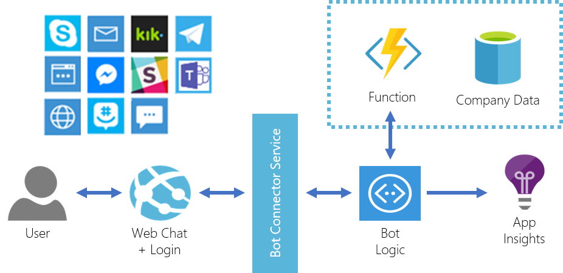

# Simple bot on azure with NodeJs
This sample shows you how to deploy a simple bot hosted on Azure Websites. 

For a complete end-to-end walk-through of creating this application, please refer to the [Bot Builder SDK for Node.js](https://docs.microsoft.com/en-us/bot-framework/nodejs/bot-builder-nodejs-overview)

## Register your bot with Microsoft
Go to https://dev.botframework.com/bots and create a new bot.
Remember the app id and app password to enter it in the next step.
Make up a unique deployment name (best would be your initials and a two digit number).
The messaging endpoint will be https://{deployment_name}botweb.azurewebsites.net/api/messages
You can fill in the other values later.

## Deploying this sample
1. Deploy the arm template in arm/template.json to azure
  

It will deploy the following resources
- Azure Web App
- Application Insights
- Code from github to the WebApp

## Prepare your blank azure vm for development

1. Open Internet Explorer (does not work on Chrome) and paste the following URL: 

http://boxstarter.org/package/nr/url?https://raw.githubusercontent.com/denniszielke/hackbotsimple/master/scboxstarter.txt

2. Click Run on the security warning. 
3. Click Run again when prompted. 
4. This will take about 5 minutes and does the setup of prerequired software: Visual Studio Code, NodeJs, Git, Google Chrome, Fiddler4

## Set the environment variables for local dev test
1. Download the bot framework emulator from https://emulator.botframework.com/ 
2. Create an .env file by renaming the .env_template file and fill in the variables from the arm template deployment output

## Run the bot locally
1. Run npm install to install the dependencies
2. Run the bot in debug mode in VSCode
3. Connect the bot emulator to your instance running on localhost (appid and apppassword have to be empty for localhost)